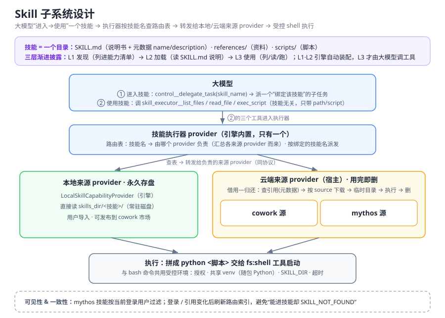

# Skill 子系统设计

Skill（技能）是一份**可复用的能力包**：一个目录，装着给大模型看的说明书和可执行脚本。
它让 agent 用"读说明书 → 列文件 → 读资料 → 跑脚本"的方式完成结构化的专业任务
（如生成 docx/pdf/pptx、领域绘图等），而不必把这些知识硬编码进提示词或引擎。



---

## 1. 一个技能是什么 · 三层模型

**技能 = 一个目录**：

```
<技能>/
  SKILL.md      说明书（正文）+ 元数据（frontmatter: name / description）
  references/   参考资料（可选）
  scripts/      可执行脚本（可选）
```

对大模型的暴露是**三层渐进披露**——用时才逐层展开，避免把整个技能塞进上下文：

| 层 | 做什么 | 谁在做 · 何时 |
|---|---|---|
| **L1 发现** | 把每个技能的 `name / description` 列进 system 提示的**可用能力清单**（与工具、子 agent 并列），大模型据此知道"有哪些技能可用" | **引擎自动** · 每轮装配提示词时 |
| **L2 加载** | 读该技能 `SKILL.md` 正文，作为"当前任务说明书"注入提示词 | **引擎自动** · 任务绑定到该技能时（云端此步才下载） |
| **L3 使用** | 列技能文件 / 读技能文件 / 跑技能脚本 | **大模型** · 调工具（见 §2） |

> **要点**：L1/L2 是**引擎自动**把"技能清单"和"说明书"装配进提示词，大模型**不调任何工具**；只有
> L3 才是大模型主动调工具。对**云端技能**：引用库只缓存 `name/description`（供 L1 列表），`SKILL.md`
> 正文与脚本**不入库**，故 L2/L3 时才**现下载**（用完即删，见 §3）；本地技能则整个目录常驻磁盘，无此步。

---

## 2. 大模型怎么用一个技能：进入 → 使用

分两步：

**第一步 · 进入技能**。大模型在能力清单里看到某技能后，派出一个**"绑定到该技能"的子任务**来使用它
（通过控制工具 `control__delegate_task`，带上要用的技能名）。这一步是进入技能的**入口**；之后引擎会
自动把该技能的 `SKILL.md` 说明书注入这个子任务的提示词（即 L2）。

**第二步 · 使用技能**。在这个绑定了技能的子任务里，大模型**不直接碰技能文件**（技能不在工作区，
云端技能更是临时的），而是用三个**技能无关**的通用工具操作它：

- `skill_executor__list_files` — 列当前技能目录文件
- `skill_executor__read_file` — 读当前技能目录文件
- `skill_executor__exec_script` — 跑当前技能脚本

**内核做了什么**：这三个工具由引擎的**技能执行器**统一提供；它维护一张"技能名 → 由哪个 provider 负责"
的路由表，按**当前子任务绑定的技能名**把调用派发到对应 provider（本地或云端），再由该 provider 完成
列/读/跑。若任务没绑定技能 → 报 `NO_SKILL_ASSIGNED`；路由表里查不到该技能 → 报 `SKILL_NOT_FOUND`。

> 注入说明书时还会附一段**运行时提示**，强制引导大模型："技能文件不在你的工作目录，读/跑技能文件
> 必须用上面三个工具，别自己 `python scripts/x.py`、别拼绝对路径。" ——把大模型从"用 bash 直接碰技能
> 文件"扳到正确工具上。

---

## 3. 技能系统的 provider 架构

技能系统建立在引擎的 **provider（可插拔实现单元）** 机制上——理解这层，就理解了整个设计。

**为什么用 provider**：引擎（`ctx_weft`）纯净、无 I/O——它不知道技能从哪来、怎么下载、放哪，只定义
**协议（接口）**，具体实现由 provider **注入**进来（经引擎的依赖注入容器 `ProviderRegistry`）。这是
"引擎纯净 + 依赖倒置"的落地方式。

技能系统由**两种角色**的 provider 组成：

| 角色 | 谁 | 职责 |
|---|---|---|
| **技能来源 provider**（实现 `SkillCapabilityProvider` 协议，**可有多个**） | `LocalSkillCapabilityProvider`（本地）、`ReferencedSkillCapabilityProvider`（云端） | 每个**负责一批技能**，自己知道怎么发现/加载/执行——本地扫磁盘、云端下载物化 |
| **技能执行器 provider**（`SkillExecutorCapabilityProvider`，引擎内置、**只有一个**） | — | 对大模型暴露那 3 个通用工具；**自己不存技能**，而是**汇总所有来源 provider**、建路由表、转发调用 |

**为什么要"技能名 → provider"路由表**：大模型的工具是**技能无关**的（`skill_executor__read_file(path)`
只带"读哪个文件"、不带"归谁管"），而技能**分散在多个来源 provider 里**。于是执行器在启动/失效后，
**逐个问来源 provider"你有哪些技能"**，汇成一张 `技能名 → provider` 表；运行时按当前任务绑定的
`skill_name` 查表，找到负责的 provider 转发过去。这张表就是**从"统一入口（3 工具）"到"分散实现（多个
provider）"之间的调度层**。

```
大模型  ── 只见 3 个通用工具 skill_executor__*
   │  按 skill_name
   ▼
技能执行器 provider ── 查"技能名 → provider"路由表（问各来源 provider 汇总而来）
   ├──────────────────┬──────────────────────────────┐
   ▼                  ▼
本地来源 provider        云端来源 provider（宿主实现）
   │                    │  借用—归还：临时起一个本地 provider 指向下载的临时目录
   ▼                    ▼
skills_dir/<技能>       引用库 + 市场（cowork / mythos）
```

**两条来源路线（同协议、对大模型无差别）**：
- **本地技能**：用户导入，永久存于 `skills_dir`。provider 直接读目录。
- **云端引用技能**：从市场"引用"过来，本地只存一条元数据（引用库）。用时走**借用—归还**：下载 zip →
  解压到系统临时目录 → 委托一个临时的本地 provider 执行 → **用完即删**。不常驻磁盘、隔离并发、跟市场更新。

**这么设计换来什么**：
- **可扩展**：要加第三种来源（另一个市场、git 同步的技能……）= 再写一个 `SkillCapabilityProvider` 注册进去，
  执行器与大模型**零改动**，路由表自动把它纳入。
- **关注点分离**：来源 provider 管各自技能的生命周期（磁盘扫描 / 下载清理）；执行器管路由 + 工具语义 +
  运行时提示；引擎管把技能装配进提示词、把任务绑定到技能。

---

## 4. 云端技能：两个市场源的整合（cowork + mythos）

云端技能来自**两个市场源**——`cowork` 与 `mythos`——被一个聚合层统一成"一个市场"，对上层
（前端展示、大模型执行）都无差别：

**① 展示（发现 / 引用）**：聚合层把两源目录**合并成一份列表**给市场页——每条带一个内部
`source` 标签（`cowork` / `mythos`，**仅供后端路由，UI 不展示**）+ `is_pulled`（是否已引用）。
任一源失败只记日志、降级返回另一源；mythos 结果按用户名短时缓存。用户点"引用"后，本地**引用库**
只写一条元数据 `{source, remote_id, name, description, owner(仅 mythos)}`。

**② 执行（大模型用技能时）**：大模型进入某云端技能、调 `skill_executor__*` 时，云端 provider
按引用里存的 **`source`** 把下载请求**派发到对应的源**（cowork 或 mythos），带当前用户名鉴权，
拉到 zip → 解压到临时目录 → 执行 → 用完即删。也就是说——**"从哪个市场来"在引用时就记在 `source`
里，执行时据它自动选后端**；大模型与执行器完全不感知两源差异，只看到"一个云端技能"。

**可见性因人而异**：mythos 技能按 `owner` 对**当前登录用户**过滤（cowork 公开不过滤）；下载带用户名防越权。
当前用户名由进程级 `current_user` 保存，登录 / 切账号时前端 `POST /skills/current-user` 写入。

**一致性要点**：`current_user` 或引用集变化时，必须**刷新执行器的路由索引**——否则登录后新可见的
云端技能不在旧索引里，大模型能进入却报 `SKILL_NOT_FOUND`。所以登录、拉市场目录、引用 / 删除引用后，都会主动让这份路由索引失效、下次用到时按当前状态重建。

**③ 上传（把本地技能发布回市场）**：本地技能卡片上的「上传」按钮 → `POST /skills/{id}/publish`。

- **现状：上传写死到全局 `cowork` 市场那一家，不看归属。** 端点固定取
  `deps.get_cowork_skill_service()`（= `build_adapter("cowork")` = pull-server，`NLC_SKILL_PULL_SERVER_URL`）。
  原因不是随意写死：**只有 `cowork` 一家支持上传**——`adapters/base.py` 的
  `import_to_remote` 基类默认抛 `UNSUPPORTED`，只有 `CoworkMarketAdapter` 覆盖实现了真上传；
  `mythos` 与各 cowork **自带的**市场都没有上传接口。所以能收上传的目标唯一，无从按归属选。
- 归属选择框（前端 `CoworkChooser`）此刻只决定**「谁能用」**，与上传去向无关。UI 提示语（`skills.ownerHint`）
  据此写明「上传目前统一发布到通用市场」。

**将来某个 cowork 自带的市场支持上传了，怎么扩展**（基础设施大半已就位，别重造）：

1. **市场服务端 + adapter**：那家市场加上传接口后，对应 adapter 实现 `import_to_remote`
   （不再抛 `UNSUPPORTED`）。mythos 形态就在 `MythosMarketAdapter` 实现；若那个 cowork 改用
   pull-server 形态，直接复用 `CoworkMarketAdapter`。
2. **`publish` 端点改成按归属路由**（`api/skills.py` 的 `publish_local_skill` + `deps.py`）：
   读 skill 归属（`references/local_owners` 的 `labels_of`）→ 归属通用/多个则发全局 `cowork`（回落，同现状）；
   归属**单个** cowork 就用 `services/market.py` 已有的 **`_adapters_for(cowork)`** 拿那个 cowork
   自带的市场 adapter 上传。**路由不用新造**——拉取（catalog/pull）早就用 `_adapters_for` 按 cowork
   路由了，上传复用同一套。目标 adapter 仍抛 `UNSUPPORTED` 时，回落通用或报「该市场暂不支持上传」（见下）。
3. **能力暴露**：`/coworks` 现返回 `has_own_market`（有没有自带市场）；再细化一个「市场**支持上传**吗」
   （adapter 自报，或 `/coworks` 多返回 `market_accepts_upload`），供前端决定提示与是否隐藏选择框。
4. **前端（小改）**：归属选择框已在，不动；`skills.ownerHint` 文案改回「归属也决定上传到哪个市场」；
   可选：上传前提示「将发布到 X 市场」；`soleAgentNoMarket` 的隐藏判断可细化成「市场不支持上传才隐藏」。

**动手前先拍板的三个产品决策**：① 归属**多个** cowork 的技能，上传发到哪（每家都发 / 只发通用）；
② 归属某 cowork 但那家市场**还不支持上传** → 回落通用还是直接报错；③ 各家市场鉴权/creator 不同，
上传带哪个 token。

> 一句话：**路由（`_adapters_for`）和「支不支持上传」的契约（`UNSUPPORTED`）都现成**，核心工作量就是把
> `publish` 从「写死全局 cowork」改成「读归属 → 走 `_adapters_for` → 目标 adapter 实现上传」，前端只是
> 文案和一个能力字段。不是大工程。

---

## 5. 执行环境

跑一个技能脚本时，provider 并不自己闷头起进程，而是**拼一条命令**（如 `python <脚本路径>`）
**交给应用的 shell 工具 `fs:shell` 去启动**——`fs:shell` 就是**大模型跑 bash 命令用的那个工具**。
于是技能脚本和 bash 命令**共用同一套受控环境**，一处管、口径一致：

- **`fs:shell`（受控 shell）**：给命令套上授权（bash 策略）、超时、输出上限、限制在会话 workspace 内。
  > 技能脚本本身可以是 python（不是 shell 脚本）；这里的 shell 只是"启动器 + 受控外壳"，用 `python <脚本>` 把它拉起来。
- **共享 venv**：借此 `python`/`pip` 命中全应用共享虚拟环境（随包 Python 创建），**不碰用户本地 python**。
- **`SKILL_DIR`**：注入环境变量，脚本可据此定位自身目录。
- **超时**：空闲超时 `NLC_SKILL_IDLE_TIMEOUT_SEC`（无输出多久算卡死）+ 硬上限 `NLC_SKILL_HARD_CAP_SEC`（墙钟总时长封顶），均可用环境变量配置。

> 有个**直跑兜底**：当没有文件系统 provider（如某些 dev 场景）时，才退回"直接起子进程"跑，此时与 `fs:shell` 无关。生产/打包态一定走 `fs:shell`。

---

## 6. 源码速查

| 位置 | 职责 |
|---|---|
| `[引擎] ctx_weft/protocols/capability.py` | `SkillCapability` / `SkillDefinition` / `SkillCapabilityProvider` 协议 |
| `[引擎] ctx_weft/core/orchestrator/skill_executor_capability.py` | 三个通用工具 + 路由索引 + 派发 |
| `[引擎] ctx_weft/providers/capability_skill_local/` | 本地 provider（扫目录、解析 SKILL.md、执行） |
| `src/netlivecowork/providers/capability/skills/provider.py` | 云端引用 provider（借用—归还）——**本包唯一的 provider** |
| `…/skills/adapters/` | 每家市场的接口方言（cowork / mythos）+ 有哪几家的注册表 |
| `…/skills/services/` | 用例层：`market.py` 市场聚合 · `local.py` 本地 skill 增删查 |
| `…/skills/references/` | 引用式加载的持久化：`store.py` 引用库 · `defaults.py` 默认引用播种 |
| `…/skills/runtime/` | 执行期机制：`materialize.py` 临时物化 · `zip_utils.py` 解包校验 · `reporting.py` 上报元数据 |
| `…/skills/legacy/` | 旧数据兼容（旧 pull 记录 → 引用），退休条件见其文档 |
| `…/skills/errors.py` · `current_user.py` | 全包共用：错误类型与 HTTP 映射 · 进程级当前登录用户 |
| `src/netlivecowork/api/skills.py` | REST 路由（导入/列表/删除/发布/市场/current-user）+ 触发路由索引重建 |
| `frontend-desktop/src/components/SkillsPage.tsx` · `api/skills.ts` | 技能管理 + 市场 UI |

> `[引擎] ctx_weft` 以 vendored wheel 交付，`uv sync` 后位于 `.venv/.../site-packages/ctx_weft/`（只读，绝不修改）。
