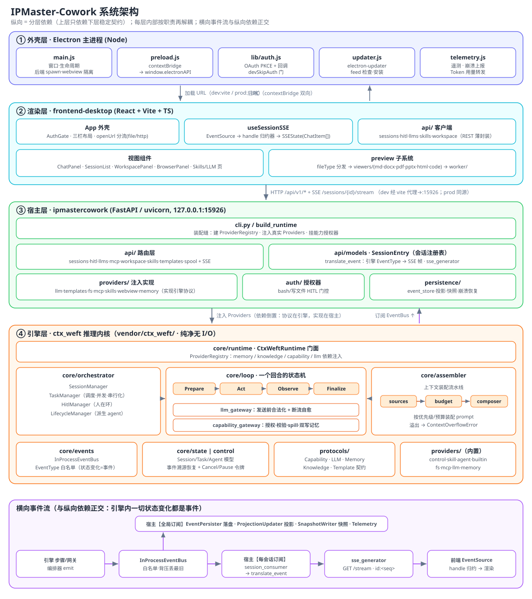

# IPMaster-Cowork 系统架构设计

> 本文是**全系统**架构文档，覆盖从 Electron 桌面外壳到底层推理引擎的完整分层。
>
> **重要立场**：`ctx_weft` 是本项目**自有的推理内核（引擎层）**，不是外部第三方依赖。它以 vendored 源码
> wheel（`vendor/ctx_weft-*.whl`）交付、打包时冻结为 PYZ 字节码，但在架构上它与 `netlivecowork`
> 后端、`frontend-desktop` 前端、`electron` 外壳一样，是本系统的一个内部分层，被本文当作一等公民描述。
>
> 与既有文档的关系：仓库根 [`ARCHITECTURE.md`](../ARCHITECTURE.md) 只讲后端宿主内部实现；本文是俯瞰全局的
> 上层设计，并把引擎层展开。行号/路径对应当前 `master`，代码演进后以源码为准。

---

## 目录

1. [系统概览与设计哲学](#1-系统概览与设计哲学)
2. [四层架构总览](#2-四层架构总览)
3. [运行时进程拓扑](#3-运行时进程拓扑)
4. [引擎层：ctx_weft 推理内核](#4-引擎层ctx_weft-推理内核)
5. [宿主层：netlivecowork 后端](#5-宿主层netlivecowork-后端)
6. [渲染层：frontend-desktop](#6-渲染层frontend-desktop)
7. [外壳层：Electron 主进程](#7-外壳层electron-主进程)
8. [端到端数据流](#8-端到端数据流)
9. [关键设计决策与不变量](#9-关键设计决策与不变量)
10. [源码目录索引](#10-源码目录索引)

---

## 1. 系统概览与设计哲学

IPMaster-Cowork 是一个**本地优先（local-first）的多智能体协作桌面应用**。用户在桌面客户端里创建"会话"，
每个会话由一个可自我编排、可派生子智能体、可调用工具/技能/MCP、支持人在环（HITL）的 agent 引擎驱动，
产出落在一个本地工作区（workspace）里，并可在右侧面板预览各类文件、内嵌浏览网页。

系统建立在两条主线上：

- **一条纵向的分层**：外壳（Electron）→ 渲染（React）→ 宿主服务（FastAPI）→ 推理引擎（ctx_weft）→ 提供方（Providers）。
  上层只依赖下层的稳定契约，下层不知道上层存在。
- **一条横向的事件流**：引擎内部一切状态变化都是**事件**；宿主订阅事件总线，把事件**落盘**（事件溯源）
  并**翻译**成前端 SSE 协议；前端把 SSE 流**归约**成 React 状态并渲染。事件是系统的单一真相来源。

设计哲学可以概括为四条：

| 原则 | 含义 |
|------|------|
| **引擎纯净** | `ctx_weft` 无任何 I/O：不碰 HTTP、DB、文件系统、真实 LLM。它只定义 Provider 协议，由宿主注入实现。这让引擎可单测、可移植、可冻结。 |
| **事件溯源** | 事件日志是真相；会话/任务投影表与快照都是派生物；崩溃恢复靠重放事件重建。 |
| **提供方注入** | LLM、记忆、能力（工具）、模板都通过 `ProviderRegistry` 注入。同一引擎在测试里注入内存实现、在生产里注入 Postgres/真实 LLM。 |
| **本地优先** | 后端、数据、workspace、技能都在用户机器上；云端只用于登录鉴权、遥测、技能市场、Token 用量上报。 |

---

## 2. 四层架构总览

每层内部并非铁板一块，而是**沿职责再解耦**成若干可独立演进、独立测试的子模块。下图纵向是分层依赖
（上层只依赖下层的稳定契约），每层内展开其内部子模块；底部单独画一条与纵向依赖正交的**横向事件流**。



> 图为 SVG（`系统架构设计.svg`），在 GitHub / 支持 Markdown 预览的 IDE 中可放大查看；若你的查看器不渲染
> SVG，直接打开该 svg 文件即可。

**读图要点**：
- **纵向是分层依赖**——上层只依赖下层的稳定契约（IPC 桥 / HTTP·SSE / Provider 协议），下层不知上层存在。
  宿主↔引擎之间是**依赖倒置**：协议（接口）定义在引擎 `protocols/`，实现（LLM/文件系统/记忆…）在宿主
  `providers/`，经 `ProviderRegistry` 注入——所以引擎能保持纯净无 I/O。
- **每层内部再解耦**——引擎层把"编排 / 循环 / 装配"三者分离，循环内又把 **LLM 网关**与**能力网关**两个收口点
  独立；宿主层把"路由 / 会话注册表 / Provider 注入 / 授权 / 持久化"分离；前端把"外壳 / SSE 归约 / API 客户端 /
  视图 / 预览"分离；外壳层把"主进程 / 桥 / 鉴权 / 更新 / 遥测"分离。每个子模块可独立演进、独立测试。
- **横向事件流独立成图**——它与纵向依赖正交，是"引擎纯净 + 事件溯源"的物理体现：宿主一端**全局订阅**做
  落盘/投影/快照，另一端**每会话订阅**把事件翻成 SSE 下发前端。

**一句话分工**：外壳管进程与云；渲染管交互与呈现；宿主把纯引擎包成可部署服务（注入真实依赖、落盘、翻译事件、
提供 REST）；引擎管推理循环、任务编排、上下文装配、HITL 与恢复。

---

## 3. 运行时进程拓扑

运行时是**三个进程**（引擎层与宿主层在同一 Python 进程内）：

| 进程 | 技术 | 端口 | dev | prod |
|------|------|------|-----|------|
| Electron 主 | Node | — | `ELECTRON_DEV=1 electron .` | 打包的 exe |
| 渲染 SPA | React/Vite | 5173(dev) | Vite dev server | 由后端在 `/` 静态托管（与后端同源） |
| Python 后端 | FastAPI/uvicorn | **15926** | 开发者自己 `netlivecowork serve` | 主进程 spawn 冻结的 `ipmaster-cowork.exe` |

关键约定（`electron/main.js`）：

- `BACKEND_URL = http://127.0.0.1:15926`——刻意用 `127.0.0.1` 而非 `localhost`：uvicorn 绑 IPv4 的
  `0.0.0.0`，`localhost` 在部分机器先解析成 IPv6 `::1` → 连不上白屏。
- **dev 与 prod 的关键差异**：dev 下主进程**不 spawn 后端**（开发者手动起），且渲染加载 `http://localhost:5173`；
  prod 下主进程 `spawn` 后端、`waitForBackend()` 轮询 `/health` 就绪后加载 `BACKEND_URL`（后端托管的 SPA）。
- prod 下后端 exe 由 `_run.py` 冻结而成：它把前端 `dist` 作为 `frontend_dist` 一起冻结并挂到 `/`，
  所以**渲染与后端在 prod 下同源**（无需 CORS、无跨端口）。
- 主进程通过注入环境变量把 `NLC_DATA_DIR / NLC_RESOURCES_DIR / NLC_SKILLS_DIR / NLC_AGENTS_DIR`
  强制指向 `%APPDATA%\IPMaster-Cowork\...`，使数据在 NSIS 更新后仍然存活。

> 另有 `Dockerfile` / `docker-compose.yml` 是同一后端的**服务端部署**（端口 8000 + Postgres 16），与桌面无关。

---

## 4. 引擎层：ctx_weft 推理内核

引擎是系统的推理心脏，位于 `vendor/ctx_weft/`（103 个 .py）。它是**事件驱动、提供方注入、步骤化的多智能体
循环引擎**：宿主注入 Provider 并驱动会话；引擎拥有推理循环、任务编排、上下文装配、崩溃/HITL 恢复。

### 4.1 顶层门面与三个核心对象

**`CtxWeftRuntime`**（`vendor/ctx_weft/core/runtime.py`，~1785 行）是唯一门面。构造时接收
`template_resolver`、`providers: ProviderRegistry`、可选 `llm`/`hitl_manager`/`event_store`/`config`，并自动装配
`InProcessEventBus`、`HitlManager`、默认 `InMemoryEventStore`，以及**自动注册三个内置能力提供方**
（`control` / `skill_executor` / `agent`）。

**`ProviderRegistry`**（`runtime.py:223`）是依赖注入容器，管四类 Provider：`memory`（单个）、`knowledge`（按优先级
有序列表）、`capability`（有序列表，可挂每-provider/每-tool 的 `Authorizer`）、`llm`（`LLMClientResolver`）。

引擎层的三个核心对象（`core/state/models.py`）：

| 对象 | 含义 |
|------|------|
| **Session** | 顶层会话容器：`id`、`user_prompt`、`status`、`root_agent_id`、token 预算/上限、失败计数/阈值、LLM 选择。一个 `TaskManager` 驱动一个会话。 |
| **Agent** | 一个 `AgentTemplate` 的实例：`id`、模板 id/版本、`parent_agent_id`、`spawn_depth`、`loop_guard`（token 记账）、`loop_config`/`memory_config` 快照。由 `LifecycleManager.instantiate_agent` 创建，受 `max_spawn_depth` 约束。记忆按 `MemoryScope(session, task, agent)` 隔离。 |
| **Task** | 工作单元（一次 actor 循环的运行目标）：`settings`、`parent_task_id`、`creator/assigned_agent`、`dag_deps`、`interaction_mode`（interactive/auto）、`outputs`、`observer_outcome`。会话根任务是 interactive（纯文本回合会停下等用户）。 |

入口 API：`start_session(SessionStartParams)`（完整编排，立即返回 `RunHandle`，异步）、`run_single_task(...)`
（单任务跑到底）、`recover_session/recover/rebuild_hitl`（崩溃/HITL 恢复）、`pause_session/pause_task/
cancel_session/compact_session`（控制面）。

### 4.2 Loop / Step 引擎——一个回合的解剖

`core/loop/driver.py` 定义状态机原语：`Step`（`async execute(state, ctx) -> StepOutcome`）、`StepOutcome`
（`next_step` / `state_patch` / `events` / `request_pause`）、`LoopState`（跨步可变状态）、`LoopContext`
（每-run 依赖包：assembler/llm/memory/event_bus/capability_gateway/hitl_manager/task_manager…）。
`StepDriver.run` 是异步生成器：按 `next_step → execute → apply patch → emit events` 循环，并发出
`STEP_STARTED/COMPLETED/FAILED`。

一个回合流经的步骤（`core/loop/steps/`）：

```
 PrepareStep ─→ ActStep ─→ ObserveStep ─→ FinalizeStep ─→ (结束)
    │            │  ↑          │                │
    │            │  └─多轮 LLM │                └─ TASK_FINISHED + 黑板发布
    │            │            └─ 产出 Verdict(success/retry/fail)
    │            └─ tool_calls 经 CapabilityGateway 分发；delegate→SUSPENDED；finish_task→退出
    └─ 装配能力入 cache · ContextAssembler 组 prompt · 触发升级式 compact · 后台识别意图
 特殊：ReconcileStep（恢复时处理悬挂 tool_calls）· SuspendStep（子任务挂起）· CompactStep
```

- **PrepareStep**：增量 token 估算、`resolve_and_bind` 能力绑入 cache、装配 prompt（`ContextAssembler`）、
  当 `token_estimate/effective_limit ≥ compact_token_ratio` 触发**升级式压缩**、根任务首回合起后台
  recognize-intent 侧任务。
- **ActStep**：多轮 LLM 子循环（≤ `max_turns_per_act`）。每轮：中断检查点 → `stream_llm_resilient`
  流式（token/reasoning/tool_calls/usage）→ token 记账（80% 上限检查）→ 决策：纯文本无工具 →
  interactive 任务冷停 `wait_for_user`；有工具 → 经网关 `_execute_tool_calls`；`finish_task` → 退出。
- **ObserveStep**：产出三态 `Verdict`（`success`/`retry`/`fail`）——对派生子任务用 LLM ReAct
  （`report_task_outcome` 终结工具），否则规则回退。机械退出（超轮数/超上限）强制 `retry`。
- **FinalizeStep**：写 finish/dispatch 记忆、发 `TASK_FINISHED`/`TASK_FAILED`/`TASK_REQUEUED` + `TASK_FINALIZED`，
  成功时 `BLACKBOARD_PUBLISH`（topic = task.id）。

**LLM 网关**（`core/loop/llm_gateway.py`）是发送前唯一收口：`legalize_messages` 强制六条提供方不变量
（丢悬挂 tool_calls、tool 结果排到其调用之后、去空消息、确保首条 user、去孤儿 tool 结果、合并同角色）；
`stream_llm_resilient` 用指数退避自愈，耗尽或中途断流则转 `LLMOutageError`（可恢复，不算失败）。

**编排器**（`core/orchestrator/`）：`TaskManager` 是每会话调度器，`drain()` 在 `max_concurrent` 与
**同-agent 串行化**约束下弹出可运行任务，处理 SUSPENDED/重试/父任务恢复/失败阈值→会话 FAILED/崩溃 restore；
`SessionManager` 负责 `create_session`（实例化根 agent、发 `SESSION_CREATED`）与 `resume_session`
（从事件存储恢复 `root_agent_id`；有未完成任务时拒绝新回合 → `UnfinishedTasksError`）。

**状态机**：Session `QUEUED/RUNNING/INTERRUPTED/SUCCEEDED/FAILED/TIMEOUT/CANCELED/PAUSED_HITL/PAUSED`；
Task `PENDING/ACTIVE/SUSPENDED/TO_BE_OBSERVED/FINISHED/FAILED/CANCELED`；Agent `IDLE/RUNNING/WAITING/FINISHED/FAILED`。

### 4.3 上下文装配（Assembler）

`ContextAssembler.assemble(ContextRequest)`（`core/assembler/`）是三段流水线：**sources（并发抓取）→ budget
→ composer → `AssembledPrompt`(system/messages/tools/token_count)**。

- **Sources**（`sources/`，`runtime._build_assembler` 装配）：`IdentitySource`（SOUL/ROLE）、`CapabilitySource`
  （工具/技能/子 agent 三类）、`TaskSpecSource`、`AgentRecallSource`（**多回合历史重建**——任务层正文 +
  agent 层对话轮，是会话连续性的关键）、`BlackboardSource`、`SemanticRecallSource`、`KnowledgeRetrievalSource`、
  `GuidanceSource`。
- **Budget**（`PriorityBudgetStrategy` + `priority.py` 静态分层）：有效优先级 = 静态槽位层 + 动态覆盖
  （当前任务 `user_prompt` 钉死为 0 永不丢；当前任务内容提级）。`tool_call↔tool_result` 合并为原子丢弃单元
  （避免孤儿结果）。丢弃序 `(-priority, 最旧, -tokens)`；只剩 0 层仍溢出 → `ContextOverflowError`。
- **Composer**（`DefaultComposer`）：按 purpose 渲染成 system+messages+tools；注入块（能力/指令/引导）追加进末尾
  user 回合；"必须以 user 结尾"的语义兜底在此，而非 LLM 网关。

**agent_recall** 是核心：派生子 agent 时（`_copy_memory_for_inherit`）把父 agent 的 recall 视图重注入子 scope，
使子 agent 带着被框定的会话上下文起步。

### 4.4 事件总线与事件

- **`Event`**（`core/events/types.py`）：`id/run_id/sequence/session_id/type/timestamp/task_id/agent_id/payload/…`。
- **`EventType`** 是冻结的 `StrEnum` 白名单（`make_event`/`TaskManager._emit` 拒绝白名单外的类型），覆盖
  Session/Run/Step、Task（含 `BlackboardPublished`）、Agent、Context（`ContextAssembled/Overflowed`）、
  LLM（`LLMTokenStreamed`/`LLMResponseFinished`/`LLMRetryTriggered`…）、**Capability**（`CapabilityInvoked/
  Progress/Finished/Failed/Canceled`）、Memory、HITL、Guard、RecognizeIntent、BackgroundObserve 等域。
- `TRANSIENT_EVENT_TYPES`（流式增量）不落盘、不投影；`TASK_STATUS_BY_EVENT` 是"事件→任务状态"的单一真相。
- **`InProcessEventBus`**（`bus.py`）：每订阅者一个 asyncio.Queue（容量 1000），背压时**丢最旧** + 发
  `EventsDropped`。两种订阅：push-handler（`subscribe`）与 pull-stream（`stream(EventFilter)` 异步迭代器，
  被 `RunHandle.events()` 使用）。`EventStore` 订阅总线以持久化。

### 4.5 提供方协议（宿主必须实现/注入的契约）

契约在 `protocols/`。能力协议（`protocols/capability.py`）是重点：

- `qualify(id)` 把 `provider:tool` 映射为 LLM 安全名 `provider__tool`。
- **`ToolCapability`**：`id`、`name`、`description`、`purposes`（act/observe/compact/recognize_intent）、
  **`input_schema`**（JSON Schema）、**`side_effects`**、**`spillable`**（网关是否可把超长输出溢写到磁盘；
  只读可重导的工具设 `False`）。另有 `SkillCapability`、`AgentCapability`。
- Provider 层级：`CapabilityProvider`（`list/retrieve/describe`）→ `ToolCapabilityProvider`
  （`invoke(...) -> AsyncIterator[CapabilityEvent]` + `cancel`）、`SkillCapabilityProvider`、
  `AgentCapabilityProvider`、`SessionScopedCapabilityProvider`（会话结束清理钩子）。

**能力网关与 spill**（`core/loop/capability_gateway.py`）是所有工具调用的统一入口：
`查找 → 授权 → 校验/coerce 参数 → 定位 provider → 记录 invocation → 流式执行 → 可能 spill →
记录结果 → 双写记忆(TOOL_INVOCATION + TOOL_RESULT)`。**spill**：当输出超 `spill_threshold` 且 `spillable`，
`_maybe_spill` 委托 `SpillSink.spill()`（文件系统 provider 把全文写进会话 workspace 并返回路径，
结果变成"截断提示 + 路径 + 预览"）；无 sink 则硬截断。特殊工具类：`DISPATCH_TOOLS`（delegate_*）、
`SILENT_TOOLS`（report_task_outcome/finish_task，不进任务对话）。

其它协议：`LLMClient`（`complete(request, stream) -> AsyncIterator[LLMChunk]`、`count_tokens`、
`LLMCallError` 的 `retriable×outage` 分类驱动重试/中断/失败）、`MemoryProvider`（单一记忆/知识/黑板抽象：
`ingest` + `recall_recent/recall_recent_by_agent/recall_topic/recall_semantic` + `apply_compact/supersede`）、
`KnowledgeProvider`、`AgentTemplate`/`TemplateResolver`（`identity: dict[Purpose, IdentityFacet]`、
`capability_refs`、`LoopConfig`）、`SpillSink`。

### 4.6 状态、控制与 HITL

- **事件溯源恢复**（`core/control/` reducers/converters/replay）：`EventStore` 支持 `list_active_session_ids`、
  `read_by_session`。重启时 `runtime.recover()` **仅凭事件**决定：有未决 HITL 的会话 → 重建 HitlManager 并标
  `PAUSED/PAUSED_HITL`（不跑，等回复）；否则发 `SessionStatusChanged(INTERRUPTED)`（等 `/resume`）。
- **控制信号**（`core/control/tokens.py`）：`CancelToken`（硬取消，检查点抛 `CancelledError`）、`PauseToken`
  （一次性软停→冷停）、`Deadline`、`RunTokens`。`pause_session` 只冷停根 agent 当前回合（单一恢复点）。
- **HITL**（`core/orchestrator/hitl_manager.py`）：一套机制（request→wait→resolve），三种形态：`approval`
  （工具门控）、`question`（`ask_user`）、`wait`（纯文本/中断冷停）。按 `tool_call_id` 幂等。超时做
  **热→冷驱逐**（抛 `HitlPark`）。冷解析触发 `on_cold_resolve` → `runtime._resume_after_cold_hitl`。
- **引擎级授权**（`core/auth/authorizer.py`）：`Authorizer.authorize(...) -> AuthorizationDecision(allowed,
  message, modified_arguments, defer)`。`defer=True` → 网关不调用 provider 而抛 `HitlPark`（安全不变量）。

### 4.7 内置提供方

- 自动注册：`ControlCapabilityProvider`（编排控制工具 `delegate_task`/`delegate_plan`/`finish_task`/
  `report_task_outcome`/`update_task_metadata`/`ask_user`）、`SkillExecutorCapabilityProvider`（技能 L3
  执行器 `list_files`/`read_file`/`exec_script`）、`TemplateAgentCapabilityProvider`（把模板暴露为子 agent，
  白名单式）。
- 随包提供方：`capability_builtin`（`http_request`，带 SSRF 防护）、`capability_filesystem`
  （`shell`/`read_file`/`write_file`/`glob`/grep，**同时实现 `SpillSink` 与会话级 workspace**）、
  `capability_mcp`（桥接 MCP，熔断+退避+预热）、`capability_skill_local`（`SKILL.md` 解析）、
  `memory_blackboard.in_memory`（单进程/测试用的完整 MemoryProvider）、`llm`（多账号
  `LLMClientResolver` + anthropic/openai/mock 适配器）。

---

## 5. 宿主层：netlivecowork 后端

宿主（`src/netlivecowork/`，87 个 .py）把纯引擎包成可部署服务。中心命题：**引擎无 I/O；宿主注入真实
Provider、订阅事件总线、把事件落盘并翻译成 UI 用的 SSE 协议、用 REST 管理会话/账号/MCP/技能/模板。**

### 5.1 组装与启动

- **`cli.py`**：`build_runtime(args)` 是核心装配缝——同步、不碰 DB/LLM：建 `TemplateStore`/`TemplateSyncer`、
  `ProviderRegistry`，注册 `InMemoryMemoryProvider`（稍后被 Postgres 替换）、`DirAgentCapabilityProvider`
  （模板）、`BashExecAliasFilesystemProvider`（文件系统+bash，别名兼容 `fs:bash_exec→fs:shell`）、
  `WebviewCapabilityProvider`、`LocalSkillCapabilityProvider`，构造 `CtxWeftRuntime`，并**挂授权器**
  （`SelectiveBashAuthorizer` 给 shell、`WorkspaceWriteAuthorizer` 给写文件——这是 HITL 门控缝）。
- **`api/main.py` `create_app()`**：写进程单例入 `api/deps.py`，注册 `lifespan`，挂路由到 `/api/v1`
  （sessions/hitl/llms/mcp-servers/workspace/skills/agent-templates+templates/内部 spool），`GET /health`。
- **`api/startup.py` `run_startup()`** 固定顺序：LLM → MCP（+prewarm）→ 技能 → DB → 模板同步 → 目录热更新
  watcher →（有 DB 时）**先 `recover()` 再 `load_sessions_from_db()`**（顺序关键：恢复须先发 INTERRUPTED
  投影，再从投影水合内存注册表）。

### 5.2 REST / SSE 面

主要在 `/api/v1`：

| 路由模块 | 前缀 | 关键端点 |
|---|---|---|
| `sessions.py` | `/sessions` | 创建/列表/详情/删除；`/messages`（多态：新回合 or HITL 回复）；`/interrupt`/`/cancel`/`/resume`；`/tasks`；`/export`·`/import`；`/bash-review-mode`；`/webview-content`；**`/stream`（SSE）** |
| `hitl.py` | `/hitl` | `/pending`；`/{id}/approve\|answer\|reject\|reply`（统一走 `hitl_service.resolve_hitl`） |
| `llms.py` | `/llms` | 账号/模型 CRUD、`/ping`、`/available-models`（seeded 账号锁定不可改） |
| `mcp.py` | `/mcp-servers` | stdio/http 注册、列表、刷新、删除 |
| `templates.py` | `/agent-templates`+`/templates` | 列表/详情/注册/删除 |
| `skills.py` | `/skills` | 本地导入/列表/发布/删除；市场 catalog/pull（聚合 cowork+mythos） |
| `workspace.py` | `/workspace` | 只读文件浏览 `/files`·`/file`·`/file/raw`，限制在已注册 workspace 根内 |
| `spool.py` | `/internal` | Electron 拉取 Token 用量的 spool + 第二条 SSE 唤醒流 |

**SSE 生成器** `sse_generator(session_id, last_event_id, lean)`（`session.py`）：先 `init`（session+tasks 快照）→
首连发一条合并的 `history`（`?lean=1` 剔除 `llm_prompt`/`daemon_prompt`，省 ~98% 首帧）/ 重连按 `Last-Event-ID`
回放缓冲 → 重推 `session_update`（捕获断连间的 INTERRUPTED）→ `PAUSED_HITL` 时从 HitlManager 重合成
`waiting_input` → 心跳 3s（`ping`）的实时循环 → `done` 收尾。

### 5.3 会话注册表与事件翻译（宿主↔引擎的协议缝）

`api/models/session.py` 的 **`SessionEntry`** 是进程内会话状态：token 计数、`sse_events`（翻译后帧缓冲）、
`cond`（Condition）、`tasks`、observe-round 状态等。

- **`session_consumer(entry, runtime, token)`**：`async for ev in runtime.event_bus.stream(EventFilter(
  session_id=...))`；`_consumer_token` 变化即退出（保证每会话单一活跃消费者）；调 `append_event`。
- **`translate_event(ev)`** 是协议翻译核心：把引擎 `EventType` 映射为 UI 帧——`STEP_STARTED(observe|act)`
  切换 observer/actor 分叉；`LLM_TOKEN_STREAMED→text_delta/observer_text_delta`；`CAPABILITY_INVOKED/FINISHED`
  join 成 `tool_call`/`control_tool_call`/`observer_*`；`HITL_REQUIRED→waiting_input` + 置 `PAUSED_HITL`；
  `SESSION_STATUS_CHANGED→session_update`(+失败/中断的 `session_notice`)；`SESSION_FINISHED→done`。
- **`_NO_PERSIST`** = `{text_delta, reasoning_delta, llm_retry, compact_started, webview_content_request}`——
  瞬态帧不入 DB 历史。

### 5.4 提供方注入（宿主实现引擎协议）

- `providers/capability/`：`webview.py`（`view_side_web_page`，`spillable=True`，内容经 `api/webview_bridge.py`
  的 request_id→Future 与前端 `<webview>` 往返）、`fs_bash_compat.py`、`mcp/`、`skills/`。
- `providers/llm/`：`LLMProvider` + `Host{OpenAI,Anthropic}Adapter`（`trust_env=False`、可关 TLS 校验以支持
  自签内网端点）、`account_store.py`（每账号 JSON）、`secret.py`（`enc:v1:` key 混淆）、`bootstrap_from_seed`
  （从打包种子 JSON 载入锁定的默认账号）。
- `providers/templates/`：`TemplateStore`（元数据 CRUD）、`TemplateSyncer`（扫 SOUL.md 同步）、
  `DirAgentCapabilityProvider`（**无缓存**从磁盘加载 → 支持热更新）。SOUL.md/ROLE.md 解析在引擎的
  `ctx_weft.providers.agent_template_local`。
- `providers/memory/postgres.py`：完整 `MemoryProvider` 的 SQLAlchemy 异步实现，在 `_setup_db` 里替换掉内存实现。

### 5.5 持久化流水线

- **DB 引擎**（`persistence/postgres/`）：`resolve_db_url` 把 `sqlite`→`sqlite+aiosqlite:///<NLC_DATA_DIR>/
  ipmc-dev.db`、`postgresql://`→`+asyncpg`；SQLite 用 `pool_size=1` 串行写 + WAL。
- **`_setup_db` 装配的事件订阅**（全 `filter=None`）：`EventPersister`（追加原始事件，跳过瞬态）、
  `ProjectionUpdater`（维护 sessions/tasks 投影表，**唯一写者**）、`SkillReporter`、`SnapshotWriter`
  （在 RunFinished 边界每 N 事件写快照，`rebuild_view` 令恢复 O(delta)）、`TelemetrySubscriber`。
- **事件存储**（`event_store.py`）：`append` + `read_by_session`（ULID 序）+ `list_active_session_ids`
  （恢复谓词，正确处理多回合会话）+ 快照存取。
- **迁移**：自研一次性数据迁移框架（**非 Alembic**），`run_pending` 幂等执行、记录在 `applied_migrations`。
- **恢复**：`recover()` 只标状态不自动续跑；`reconcile_stranded_running_sessions` 修投影里卡在 RUNNING 的行；
  `load_sessions_from_db` 从投影水合 `_sessions`。消费者在用户触发 `/resume` 或 `/messages` 时才起。

### 5.6 管理器、热更新与授权

- **MCP**（`MCPProviderManager`）：REST CRUD ↔ `ProviderRegistry`，删除时不关闭 provider（在跑的会话继续）。
- **技能**：服务层 `LocalSkillService` + `SkillReferenceStore` + `SkillMarketService`（聚合 cowork+mythos）
  + `ReferencedSkillCapabilityProvider`（云技能按需物化执行）。
- **热更新**（`DirectoryWatcher`）：守护线程轮询目录 `mtime_ns`（默认 5s）；`agents_dir` 变→模板同步；
  `skills_dir` 变→技能缓存失效。
- **能力授权**（`auth/`，即 HITL 门控）：`SelectiveBashAuthorizer`（按 `bash_policy.classify` 分类 shell 命令，
  网络命令 DENY、危险动词/越界路径 CONFIRM，把结构化风险 JSON 作为 HITL 问题给前端本地化）、
  `WorkspaceWriteAuthorizer`（越界写 auto 硬拒/manual 确认）、`BashReviewModeStore`（每会话 auto/manual）。

> **注意**：Huawei/云登录鉴权在 **Electron/前端层**，后端本身**无**登录/Token 校验，REST 路由在宿主层未鉴权
> （由桌面外壳在前面把关）。后端唯一的 Token 透传是把客户端 `Authorization` 头转发给外部技能市场做归属。

---

## 6. 渲染层：frontend-desktop

React 18 + Vite + TS 的 SPA（`frontend-desktop/src/`，98 个 .ts/.tsx）。入口 `main.tsx → App.tsx`。
所有后端流量走相对 `/api/v1/*`，dev 由 `vite.config.ts` 代理到 `:15926`（SSE 路由专门保 `text/event-stream`）。
状态 = React 本地态 + `@tanstack/react-query`；i18n 是手写 Context（zh 基 + en）。

### 6.1 App 外壳与布局

Provider 栈：`LanguageProvider → App → QueryClientProvider → AuthGate`。**AuthGate**：无 Electron 桥（纯浏览器
调试）→ 跳过登录直接进；有桥则 `getSession()`（`null`→`LoginGate`，否则 `Desktop`）。

**Desktop 三栏**：左 `SessionList`（可折叠、宽度持久化）；中间白卡按 `centerView` 渲染 `SkillsPage`/
`LLMSettingsPage`/`ChatPanel`；右卡 Tab 条切换 Files/Preview/Web（三个面板都常挂，用 `display` 切换以保留
浏览历史/滚动/预览态）。单一 SSE 订阅在此：`useSessionSSE(centerView==='chat' ? selectedId : null)`。
`openUrl` 按协议分流：`file://`→`openPreview`（预览 tab）、`http(s)`→`BrowserPanel`（网页 tab）。

### 6.2 SSE 消费——数据流枢纽

`hooks/useSessionSSE.ts`（~680 行）定义 item/event 模型（`ChatMessage`/`ChatToolCall`/`ChatWaitingInput`/
`ChatObserverMessage`/`ChatHitlAnswer` → `ChatItem`）与 `SSEState`。连接 `new EventSource('/api/v1/sessions/
${id}/stream?lean=1')`；`epoch` 强制重订阅；**僵尸连接看门狗**每 2s 检查（>5s 无事件且 OPEN 则重连，
但看门狗自身被饿死时改为延后，避免打断正在输入的 HITL 面板）。

`handle` 归约器把帧转状态：`history`（批量回放，tool_call 按 id 建 Map 做 O(1) 就地填充）、`token_update`/
`session_update`/`session_notice`、`message`（user 回复与前一 `waiting_input` 配对成 `hitl_answer`）、
`tool_call_pending`/`tool_call`、`waiting_input`/`bash_exec_confirm`（升级进 `pendingHitls`）、流式
`text_delta`/`reasoning_delta`（`observer_*` 故意不显示）、`webview_content_request`（抓 webview 内容回 POST）、
`done`（关 EventSource 阻止终态会话自动重连）。`pendingHitls` 以 `GET /hitl/pending` 为准做带 epoch 守卫的对账。

### 6.3 聊天体验

`components/ChatPanel.tsx`（~1872 行）：`react-virtuoso` 虚拟化，`groupItems()` 合并连续 tool_call，流式气泡作为
最后一行数据（配合 `followOutput` 底部跟随）。Markdown：`MD_REMARK_PLUGINS=[remarkGfm, remarkMath,
remarkFixAutolink]` + `rehypeKatex` + `MD_URL_TRANSFORM`（放行 http(s)/file/mailto/tel）；`code`/`a` 渲染器把
本地文件路径与链接接到 `OpenUrlContext`；**用户文本按 `PlainText` 渲染，不当 markdown**。HITL：
`WaitingInputPanel` 分 approval/bash（批准/拒绝）/`StructuredQuestions`（单多选+"其它"）/回复文本框。Composer：
Enter 发送、token 限额（`inputLimit`，20k tokens / 200k chars 硬顶，超限禁发）、模型选择、运行时中断按钮。
另有 Ctrl+F（CSS Custom Highlight API 词级高亮，数据源自 `listData`）、observer 紫卡（只显示 retry/fail）、
工作模式 select（bash auto/manual）、`SessionNoticeBar`（FAILED/INTERRUPTED 时替换 composer）。

### 6.4 文件预览子系统

- 分发 `preview/fileType.ts`：`getExt`（含无扩展名 Dockerfile/LICENSE 兜底）+ `fileType(ext)→PreviewType` +
  `CODE_LANGS`（ext→highlight.js 语言）。
- 宿主 `components/FilePreviewModal.tsx`（`FilePreviewContent`，右侧 Preview tab）+ 工具栏系统
  （`usePreviewToolbar` 注册 search/zoom/pages/toc/download/copy 能力）。
- 各 viewer：`MarkdownViewer`（remark-gfm + mermaid + frontmatter 以 yaml 代码块显示 + 工作区内链走
  `onNavigate`）、`DocxViewer`（docx-preview + JSZip 预处理浮动文本框 + fit-to-width `zoom`）、`PdfViewer`
  （完整 pdf.js 栈 + 大纲→TOC + CJK CMaps）、`ExcelViewer`（**web worker** 解析 xlsx）、`PptxViewer`
  （主线程 DOMParser 解析 + 每片虚拟化 + EMF/WMF→PNG 经 `electronAPI.convertEmf`）、`HtmlViewer`
  （沙箱 iframe）、`CodeViewer`（highlight.js，>200KB 跳高亮）、`Text`/`Image`。
- **内嵌浏览器** `components/BrowserPanel.tsx`：Electron `<webview>`（`partition="persist:inappbrowser"`）用于拒
  iframe 的外部页；注册 `setWebviewExtractor` 让 SSE 的 `webview_content_request` 能抓当前页
  （title/text/headings/links）喂给 `view_side_web_page` 工具。

### 6.5 与 Electron 的通信

渲染只经 `window.electronAPI`（preload 桥）与主进程通信，从不直接碰 Node：选目录/开路径、开外链、
OAuth（login/logout/getSession/getToken）、版本/更新（getVersion/checkForUpdates/installUpdate/onUpdateStatus）、
EMF 转换、会话上报、`signalReady`（清白屏看门狗）。桥缺失即"纯浏览器调试"模式（跳过登录、禁用 Electron 专属功能）。

---

## 7. 外壳层：Electron 主进程

`electron/main.js`（+ `preload.js`/`telemetry.js`/`updater.js`/`lib/auth.js`），版本 0.4.23。

- **拉起后端** `startBackend()`：解析 exe 路径（packaged→`resourcesPath/backend/ipmaster-cowork.exe`，
  dev→`build/dist/...`），`spawn` 并注入 `NLC_*` 环境（端口/数据目录/资源目录），stdout/stderr 写
  `%APPDATA%\...\logs\electron.log`。dev 下不 spawn；prod 下先探 `/health` 复用已存在的健康后端。
  `waitForBackend()` 每 500ms 轮询 `/health`（~30s 预算）。
- **窗口与加载**：自定义隐藏标题栏、`backgroundColor:#f0f4fa` 防黑闪、`webviewTag:true`；先加载 splash
  `data:` 页再 `show()`；dev 加载 vite、prod `waitForBackend` 后加载后端 SPA 并 arm **白屏看门狗**（20s 内未
  `signalReady` 弹重试对话框）。`setWindowOpenHandler`/`will-navigate` 把所有外链/整页导航挡到系统浏览器；
  `will-attach-webview`/`did-attach-webview` 把内嵌 `<webview>` 隔离进独立 partition、剥离 preload/Node。
- **IPC 桥**（`preload.js`→`window.electronAPI`）：`select-directory`/`open-path`/`open-external`/`app-version`/
  `update-check`/`update-install`/`report-session`/`convert-emf`/`auth-*`/`renderer-ready`/`update-status`。
- **鉴权**（`lib/auth.js`）：桌面浏览器 OAuth（Authorization Code + PKCE + loopback 回调），token 经
  `safeStorage` 加密存 `%APPDATA%\...\auth.bin`；云请求走 Electron `net.fetch`（用系统证书库，兼容自签内网 CA）。
  `devSkipAuth` 仅在 `!isPackaged && appConfig.devSkipAuth===true` 生效（打包永远 false），读**工厂**
  `app-config.json`（避免 AppData 副本里 seeded 的 false 遮蔽）。
- **自动更新**（`updater.js`）：`!isPackaged` 或空 `feedUrl` 时禁用；electron-updater generic feed；
  事件经 `webContents.send('update-status', ...)` 推给渲染（即 update-nag）；`update-install` 先 `stopBackend()`
  按 PID 杀后端（不用 `taskkill /IM`——`ipmaster-cowork.exe` 与 `IPMaster-Cowork.exe` 大小写不敏感会误杀自身）
  再 `quitAndInstall`。
- **打包**（`packaging/build_electron.ps1`）：①前端 build → ②PyInstaller 冻结后端（`_run.py` 入口，
  把 `frontend-desktop/dist` 作为 `frontend_dist` 一起冻结，`collect_submodules("ctx_weft")` 把**引擎冻进 PYZ
  字节码、不出 .py 源**）→ ②b 拷工厂资源 + 下载 hermetic `python-runtime`（供冻结后端建 workspace venv）→
  ③electron-builder NSIS，把 `build/dist/ipmaster-cowork` 作为 `extraResources` 塞进 `resources/backend`。
  纪律：任何改动（哪怕纯前端）都要整包重建，因为前端 dist 嵌在 PyInstaller 后端里。

---

## 8. 端到端数据流

以"用户在已有会话里发一条消息"为例，一条请求如何穿透四层：

```
① 用户在 Composer 输入并回车
   frontend: ChatPanel → sessionsApi.sendMessage(POST /api/v1/sessions/{id}/messages)

② 后端 api/sessions.py send_message
   终态会话 → SessionStartParams.create(..., resume=True) → runtime.start_session()
   并 append 一条 user `message` SSE 帧、重启 session_consumer

③ 引擎 CtxWeftRuntime.start_session
   SessionManager 恢复根 agent → TaskManager.drain() → _SessionTaskRunner
   → StepDriver 跑 Prepare→Act→Observe→Finalize

④ ActStep 每轮
   ContextAssembler 组 prompt → LLM 网关 legalize → LLMProvider.complete 流式
   → 发 LLM_TOKEN_STREAMED / LLM_RESPONSE_FINISHED
   → 若有 tool_calls：CapabilityGateway → Authorizer 授权（bash/写文件可能抛 HitlPark→HITL）
     → provider.invoke 流式 → CAPABILITY_INVOKED/PROGRESS/FINISHED（超长则 spill 到 workspace）

⑤ 事件回流（横向事件流）
   所有事件进 InProcessEventBus
   → 宿主全局订阅：EventPersister 落盘 / ProjectionUpdater 更新投影 / SnapshotWriter 快照
   → 宿主每会话订阅：session_consumer → SessionEntry.translate_event
     把引擎 EventType 翻成 SSE 帧（text_delta / tool_call / waiting_input / session_update…）
     缓冲进 sse_events 并按需落盘

⑥ SSE 推送
   sse_generator 经 GET /sessions/{id}/stream 把帧以 `id: <seq>` 持续下发

⑦ 前端消费
   useSessionSSE 的 EventSource 收帧 → handle 归约器 → 更新 SSEState.items
   → ChatPanel 虚拟化渲染流式气泡/工具卡/HITL 面板

⑧ 若命中 HITL
   waiting_input 帧 → 前端 WaitingInputPanel → 用户批准/回答
   → hitlApi(POST /hitl/{id}/approve|answer) → hitl_service.resolve_hitl
   → HitlManager 冷解析 → runtime 续跑 → 回到 ④
```

**工具类特殊数据流——`view_side_web_page`**（读右侧网页）：引擎 `WebviewCapabilityProvider.invoke` →
`webview_bridge.request_content(session_id)`（发 `webview_content_request` SSE 帧 + 建 Future）→ 前端
`useSessionSSE` 收帧 → `BrowserPanel` 抓当前 `<webview>` 页内容 → `POST /sessions/{id}/webview-content` →
`webview_bridge.resolve` 完成 Future → 工具返回内容（可 spill）。这条链完整体现了"引擎发起 → 经宿主 SSE →
前端执行 → 回宿主 → 回引擎"的往返，且**未触碰引擎内部业务逻辑**。

---

## 9. 关键设计决策与不变量

| 决策 / 不变量 | 说明与理由 |
|---|---|
| **引擎纯净（无 I/O）** | `ctx_weft` 只定义协议、不做 I/O。可单测、可移植；宿主注入 Postgres/真实 LLM/文件系统。 |
| **事件是单一真相** | 事件日志 append-only 为真相；投影表/快照/内存注册表都是派生；崩溃恢复靠重放。`EventType` 白名单强约束。 |
| **EventType→状态单一映射** | `TASK_STATUS_BY_EVENT` 是 reducer/投影/SSE 共用的唯一真相，避免状态推导分叉。 |
| **能力网关统一收口** | 所有工具调用经 `CapabilityGateway`：授权、参数校验、记账、spill、双写记忆——安全与可观测集中一处。 |
| **spill 而非硬编码长度** | 超长工具输出溢写到 workspace 返回路径，不在工具里写死截断；`spillable=False` 的只读工具可重导则不 spill。 |
| **HITL = 一套机制三种形态** | approval/question/wait 统一 request→wait→resolve，按 `tool_call_id` 幂等，支持热→冷驱逐与跨重启恢复。 |
| **恢复只标状态、不自动续跑** | `recover()` 标 INTERRUPTED/PAUSED，等用户 `/resume`——避免重启即自动烧钱/误动作。 |
| **鉴权在外壳、不在后端** | 后端 REST 未鉴权，由 Electron 外壳把关；`devSkipAuth` 仅非打包生效。降低后端复杂度，本地信任边界清晰。 |
| **workspace 授权门控** | bash 网络命令 DENY、危险/越界 CONFIRM；越界写 auto 硬拒。内网安全策略前置到工具执行前。 |
| **vendored 源码 wheel** | 引擎以含 .py 的 wheel 交付，dev/协作者 `uv sync` 后可 IDE 跳转/断点；打包冻成 PYZ 字节码不出源（IP 保护）。 |
| **前端瞬态帧不落盘** | `_NO_PERSIST` 把流式增量挡在 DB 历史外；`?lean=1` 剔除巨大的 prompt 帧，省首帧带宽。 |
| **127.0.0.1 而非 localhost** | 规避 IPv6 `::1` 解析导致的连不上白屏。 |
| **prod 同源托管** | 后端把前端 dist 挂在 `/`，渲染与后端同源，免 CORS、免跨端口。 |

**只读边界**：`vendor/ctx_weft` 是引擎核心，**绝不修改**——需要新工具/能力时在宿主 `netlivecowork` 侧新增
Provider（如 `view_side_web_page` 就是宿主的 `WebviewCapabilityProvider`），通过协议注入，而不动引擎。

---

## 10. 源码目录索引

```
IpMasterCoworkPy/
├── vendor/ctx_weft/              ★ 引擎层（推理内核，只读）
│   ├── core/
│   │   ├── runtime.py            CtxWeftRuntime 门面 + ProviderRegistry
│   │   ├── orchestrator/         TaskManager / SessionManager / control 工具 / HitlManager
│   │   ├── loop/                 StepDriver + steps/(prepare/act/observe/finalize/…) + llm_gateway + capability_gateway
│   │   ├── assembler/            ContextAssembler + sources/ + budget + composer + priority
│   │   ├── events/               InProcessEventBus + EventType/Event
│   │   ├── state/                Session/Task/Agent 模型 + event_store
│   │   ├── control/              事件溯源 reducers/converters/replay + Cancel/Pause 令牌
│   │   └── auth/                 引擎级 Authorizer 抽象
│   ├── protocols/                Capability / LLM / Memory / Knowledge / Template / SpillSink 契约
│   └── providers/                内置：control/skill_executor/agent/builtin/filesystem/mcp/skill_local/llm/memory_blackboard
│
├── src/netlivecowork/           ★ 宿主层（后端服务）
│   ├── cli.py                    build_runtime（装配缝）+ serve/run/migrate
│   ├── api/
│   │   ├── main.py startup.py deps.py       create_app / lifespan / 进程单例
│   │   ├── sessions.py hitl.py llms.py mcp.py workspace.py skills.py templates.py spool.py
│   │   ├── webview_bridge.py                 view_side_web_page 的前后端往返
│   │   └── models/session.py                 SessionEntry + translate_event + sse_generator
│   ├── providers/                capability/(webview,fs,mcp,skills) · llm · templates · memory/postgres
│   ├── auth/                     bash/写文件授权器 + bash_policy + BashReviewModeStore
│   └── persistence/postgres/     event_store · projection · snapshot · migrations · reconcile
│
├── frontend-desktop/src/         ★ 渲染层（React SPA）
│   ├── App.tsx main.tsx          三栏外壳 + AuthGate + openUrl/openPreview
│   ├── hooks/useSessionSSE.ts    SSE 消费与归约（数据流枢纽）
│   ├── api/                      client · sessions · hitl · llms · skills · workspace
│   ├── components/               ChatPanel · SessionList · WorkspacePanel · BrowserPanel · SkillsPage · LLMSettingsPage · FilePreviewModal
│   ├── preview/                  fileType · viewers/ · toolbar/ · worker/
│   └── lib/ i18n.tsx types/      remarkFixAutolink · activity · inputLimit · toolCallMerge …
│
├── electron/                     ★ 外壳层（主进程）
│   ├── main.js                   进程/窗口/后端 spawn/IPC/webview 隔离
│   ├── preload.js                window.electronAPI 桥
│   ├── lib/auth.js               OAuth PKCE + devSkipAuth
│   ├── updater.js telemetry.js   自动更新 / 遥测
│   └── app-config.json           netcoworkBaseUrl · feedUrl · telemetryUrl · devSkipAuth
│
├── _run.py                       打包 Python 入口（冻结后端 + 挂 SPA）
├── packaging/                    build_electron.ps1 · ipmaster-cowork.spec · default_data/
├── ARCHITECTURE.md               后端宿主内部实现（更细）
└── docs/系统架构设计.md          ← 本文（全系统）
```
