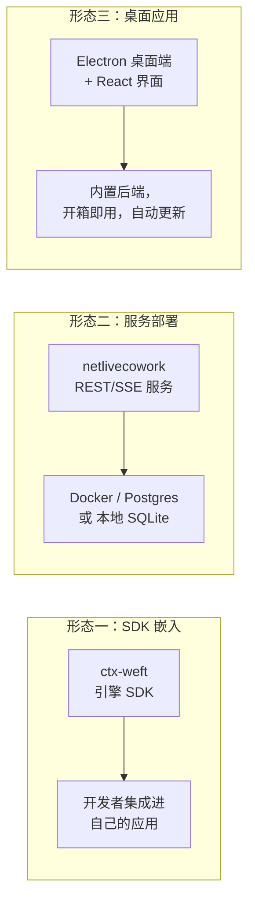
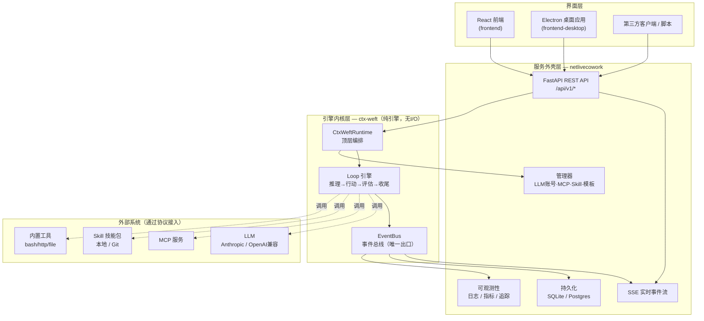
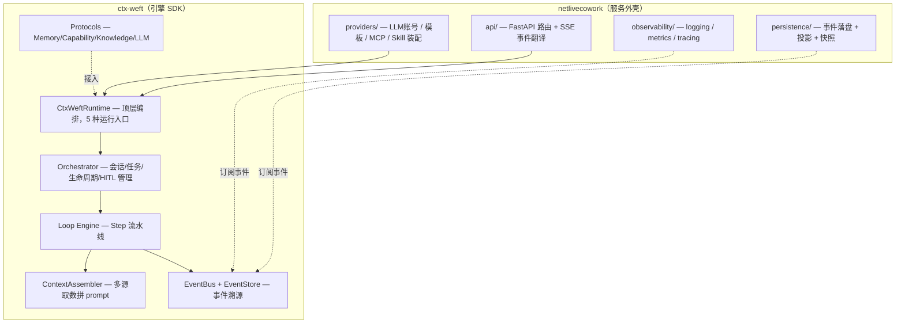
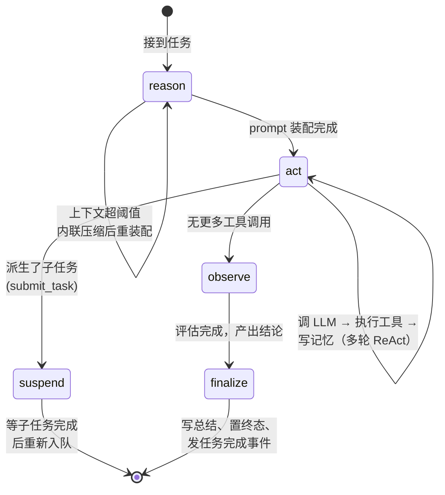
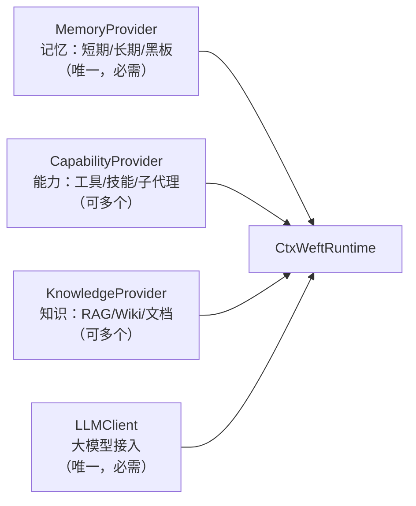

# IPMaster-Cowork 项目介绍（产品经理版）

> 一句话：IPMaster-Cowork 是一套**可控、可观测、可私有部署的 AI Agent 运行平台**——既是给开发者用的引擎 SDK，也是开箱即用的服务和桌面应用，让 AI 代理能够自主规划、调用工具、执行多步任务，同时把每一步都「看得见、管得住、可恢复」。

本文面向产品经理，兼顾产品价值与技术架构。开篇先讲「它是什么、亮点在哪」，再讲「解决什么问题、能做什么」，最后讲「技术上怎么实现的」，配技术架构图。

---

## 目录

1. [产品概览](#1-产品概览)
2. [核心亮点与差异化优势](#2-核心亮点与差异化优势)
3. [解决什么问题](#3-解决什么问题)
4. [核心能力清单](#4-核心能力清单)
5. [典型应用场景](#5-典型应用场景)
6. [产品形态与交付](#6-产品形态与交付)
7. [技术架构总览](#7-技术架构总览)
8. [分层架构详解](#8-分层架构详解)
9. [Agent 执行循环（引擎心脏）](#9-agent-执行循环引擎心脏)
10. [一次对话的完整数据流](#10-一次对话的完整数据流)
11. [关键机制（PM 需要理解的几个设计）](#11-关键机制pm-需要理解的几个设计)
12. [扩展性：三大协议 + 插件生态](#12-扩展性三大协议--插件生态)
13. [现状与成熟度](#13-现状与成熟度)
14. [术语表](#14-术语表)

---

## 1. 产品概览

IPMaster-Cowork 是一个**面向「让 AI 代理替人完成多步任务」的基础设施平台**。它不是又一个聊天机器人，而是一套支撑「AI 自主干活」的运行时：你给它一个目标（比如「研究并撰写一份报告」），它会自己拆解任务、调用工具（执行命令、读写文件、访问 API、调用外部服务）、必要时派生子代理协作，并在关键节点暂停等待人工确认。

整个产品由两层构成，可以分开用、也可以一起用：

| 层 | 名字 | 角色 | 类比 |
|----|------|------|------|
| 引擎层 | **ctx-weft** | 纯粹的 Agent 运行内核（Python SDK，无数据库、无网络、无界面） | 「发动机」 |
| 服务层 | **netlivecowork** | 把引擎包成可部署服务：REST/SSE API、数据库、账号管理、崩溃恢复、可观测性 | 「整车」 |

外加一个 **React 前端 + Electron 桌面应用**，让非开发者也能通过图形界面使用。

**一句话定位**：ctx-weft 是发动机，netlivecowork 是整车，桌面端是方向盘和仪表盘。

---

## 2. 核心亮点与差异化优势

相对「裸接 LLM + 工具」的简单 Agent，IPMaster-Cowork 真正的价值在于把「能不能放心交给它干活」的几件硬事做到了内置：

- **可控性**：关键动作（默认所有 shell 执行）会暂停等人工审批，可批准/拒绝/改参数后放行；敏感操作可挂鉴权器拦截。企业敢把自动化交给它。
- **可观测性**：基于**事件溯源**，AI 的每个动作都是不可变事件，可通过实时流（SSE）边跑边看、也能事后回放。过程不是黑盒。
- **可靠性**：**崩溃恢复 + 续跑**、上下文自动压缩、失败重试——长任务跑一半进程崩了也能从断点接上。
- **可扩展性**：「协议 + 插件」解耦，接系统是注册一个 MCP、加能力是写一个 Skill、造角色是写两个 Markdown，多数可运行时热更新，不必改引擎代码。
- **可私有化**：从本地 SQLite 到自建 Postgres 到桌面应用，数据不出门；LLM 可接私有/本地模型（任何 OpenAI 兼容端点）。
- **架构干净**：引擎与服务彻底解耦，既能当 SDK 嵌入自己的产品，也能当服务独立部署。

**一句话总结**：别人解决「让 AI 能调工具」，IPMaster-Cowork 解决「让 AI 干活这件事可控、可观测、可恢复、可私有部署」——这正是从「玩具」到「生产可用」的分水岭。

**给 PM 的几点提示**：

- 平台是「基础设施 + 平台」型产品，价值通过「在它之上配置出的具体 Agent/场景」释放——值得围绕「场景模板 / 行业方案」做产品化包装。
- 可控、可观测、可私有化是面向 B 端的核心卖点，适合主打「安全可控的企业级 AI 自动化」。
- 「写两个 Markdown 就能造一个 Agent」是降低使用门槛、做生态/市场的好抓手。

---

## 3. 解决什么问题

市面上把 LLM 接成「能调工具的 Agent」并不难，但要做成**生产可用、企业敢用**的产品，有几个绕不过去的痛点。IPMaster-Cowork 的设计正是围绕这些痛点：

**痛点一：AI 干活不可控，容易闯祸。**
Agent 自动执行 shell 命令、改文件、调外部接口，一旦失控后果严重。本平台内置 **HITL（Human-in-the-Loop，人工审批）**：默认情况下，AI 每次要执行 shell 命令都会暂停，等人点「批准/拒绝/改一下再执行」。敏感操作可挂「鉴权器」拦截。

**痛点二：AI 干活像黑盒，出了问题查不到。**
本平台基于**事件溯源（Event Sourcing）**——AI 的每一个动作（想了什么、调了什么工具、得到什么结果、花了多少 token）都被记录为不可变事件，全程可通过实时流（SSE）观看，也能事后回放。PM 和运营能清楚看到「AI 到底做了什么」。

**痛点三：长任务跑一半进程崩了，前功尽弃。**
因为有完整事件流，本平台支持**崩溃恢复**：服务重启后，没跑完的会话会被标记为「中断」，用户点一下就能从断点续跑，不用重头再来。

**痛点四：换模型/接新工具就要改代码。**
平台用「协议 + 插件」的方式解耦：换 LLM 账号、接入新的 MCP 服务、加载新的 Skill 技能包、新增 Agent 模板，大多可在运行时通过 API 或改配置文件热更新完成，**不必重启、不必改引擎代码**。

**痛点五：数据敏感，不能上公有云。**
平台可完全私有部署（Docker / 本地 SQLite / 自建 Postgres），LLM 也能接私有或本地模型（任何 OpenAI 兼容端点，如本地 Ollama）。

---

## 4. 核心能力清单

| 能力 | 说明 | 对 PM 的意义 |
|------|------|-------------|
| **多步自主任务执行** | AI 按「推理→行动→评估」循环自主完成任务，可派生子代理并行/串行协作 | 能承接复杂的、需要多个步骤的真实工作，而非一问一答 |
| **任务规划与拆解** | 内置 `planner` 规划代理，把大目标拆成结构化任务列表 | 复杂任务自动分解，过程透明 |
| **内置工具集** | bash 执行、HTTP 请求、文件读/写/编辑、glob/grep 搜索 | 开箱即用，覆盖常见「干活」需求 |
| **MCP 接入** | 一键注册任意 MCP 服务（标准协议），把外部系统变成 AI 可调的工具 | 接入企业内部系统、第三方服务的标准通道 |
| **Skill 技能包** | 加载本地或 Git 仓库的 SKILL.md 技能（含脚本与参考资料） | 沉淀可复用的领域能力，团队共享 |
| **人工审批（HITL）** | 关键动作暂停等人确认，可批准/拒绝/改参数后放行 | 风险可控，满足合规要求 |
| **实时过程可视** | SSE 事件流，前端实时展示 AI 的思考、工具调用、任务树、token 消耗 | 过程全透明，便于演示与排查 |
| **崩溃恢复 / 续跑** | 进程重启后未完成会话可从断点续跑 | 长任务可靠，体验不打折 |
| **多 LLM 账号管理** | 同时管理多个 Anthropic / OpenAI 风格账号与模型，运行时切换 | 成本与能力灵活调配，支持私有模型 |
| **记忆与上下文压缩** | 短期对话窗口 + 长期记忆 + 超长上下文自动压缩 | 长对话不爆上下文，成本可控 |
| **可观测性** | 结构化日志、Prometheus 指标、OpenTelemetry 链路追踪 | 运维可监控，问题可定位 |
| **私有化部署** | Docker（Postgres）、本地 SQLite、桌面应用三种形态 | 数据不出门，适配企业 IT 要求 |

---

## 5. 典型应用场景

- **自动化研究与文档撰写**：给定主题，AI 自主检索资料、读写文件、产出结构化报告（README 中的示例即「研究并撰写量子计算报告」）。
- **运维/数据任务助手**：通过受控的 bash 与文件工具，让 AI 在审批保护下完成脚本执行、数据整理、批处理等任务。
- **企业系统的 AI 操作层**：通过 MCP 把内部 CRM、知识库、工单系统等接成工具，让 AI 成为跨系统的统一操作入口。
- **可复用的领域智能体**：用 Skill + Agent 模板沉淀「客服流程」「合同审阅」「代码审查」等专项能力，团队按需调用。
- **嵌入式 Agent 引擎**：开发团队直接拿 ctx-weft SDK 嵌进自己的产品，跳过整套服务外壳。

---

## 6. 产品形态与交付

平台支持三种部署/使用形态，覆盖从开发者到终端用户：



- **SDK 嵌入**：`pip install ctx-weft`，开发者直接用引擎。
- **服务部署**：`netlivecowork serve` 启动 HTTP/SSE 服务；或 `docker compose up` 带 Postgres 一起起。提供完整 REST API（`/docs` 有 Swagger）。
- **桌面应用**：Electron 打包（当前面向 Windows），内置 PyInstaller 打包的 Python 后端，带自动更新（electron-updater）。终端用户无需配置环境。

当前版本 **0.4.4**，引擎与服务约 **2.3 万行 Python**，前端约 **1.7 万行 TypeScript**，配套较完整的测试与文档。

---

## 7. 技术架构总览

整体是一个清晰的分层结构：**界面层 → 服务外壳层 → 引擎内核层**，外部系统通过「协议」接入，所有状态变更通过「事件总线」统一流出。



**核心设计原则**：引擎（ctx-weft）是「纯」的——不碰数据库、不开 HTTP、不读文件、不依赖任何具体 LLM SDK。所有「脏活」（落盘、网络、界面）都由服务外壳（netlivecowork）注入。这让引擎可独立测试、可嵌入任何宿主，也让服务层可以自由替换持久化/部署方案。

---

## 8. 分层架构详解



各层职责：

**界面层**：React 单页应用（会话列表、聊天面板、任务时间线、工具调用表、LLM/MCP/Skill/模板管理页），通过 SSE 实时订阅 AI 执行过程。Electron 把前端 + Python 后端打包成桌面应用。

**服务外壳层（netlivecowork）**：
- `api/`：FastAPI 路由（sessions / hitl / llms / mcp-servers / skill-sources / templates），并把引擎的原始事件**翻译**成面向 UI 的协议后通过 SSE 推送。
- `providers/`：把「运行时通过 API 增删的 LLM 账号、MCP 服务、Skill 源、Agent 模板」桥接到引擎，并负责 JSON/DB 持久化。
- `persistence/`：三个事件订阅者——事件落盘（单一事实源）、投影更新（供列表查询与重启恢复）、快照写入。支持 SQLite（本地，WAL 调优）与 Postgres（生产）。
- `observability/`：结构化日志、Prometheus 指标、OpenTelemetry 追踪。

**引擎内核层（ctx-weft）**：顶层 `CtxWeftRuntime` 编排一切；`Orchestrator` 管理会话、任务队列、Agent 生命周期与人工审批；`Loop Engine` 是执行心脏；`ContextAssembler` 负责把记忆/能力/知识/身份拼成发给 LLM 的 prompt 并按 token 预算裁剪；`EventBus` 是所有状态变更的唯一出口。

---

## 9. Agent 执行循环（引擎心脏）

每个任务的执行，本质是一条 **推理 → 行动 → 评估 → 收尾** 的循环（业界称 ReAct 模式的工程化）。这是理解「AI 怎么干活」的关键。



四个阶段：

- **reason（推理）**：把当前任务、最近对话、可用工具、Agent 人格等装配成 prompt。如果上下文太长超过阈值，会先**内联压缩**（把历史浓缩成摘要）再继续。
- **act（行动）**：核心的 ReAct 循环——调用 LLM，LLM 决定调哪个工具，执行工具、把结果写回记忆，再调 LLM……直到 LLM 认为不需要更多工具，或达到轮数上限。如果 LLM 选择「派生子任务」，当前任务挂起，转入 suspend。
- **observe（评估）**：由「观察者」角色评估任务是否真正完成，产出结论（成功/失败 + 总结）。这是一种**自我校验**机制，把「执行」与「评判」分开。
- **finalize（收尾）**：写入总结、把任务标记为终态、发出「任务完成」事件。

**多代理协作**：当任务复杂时，`act` 阶段可以通过控制工具派生子代理（最大嵌套深度可配，默认 4 层），子任务完成后父任务自动恢复。这让平台能处理「先规划、再分头执行、最后汇总」的复杂工作流。

---

## 10. 一次对话的完整数据流

下面这张时序图展示了用户从发起任务到看到结果的完整链路，包含了 HITL 暂停这一关键环节：

```mermaid
sequenceDiagram
    participant U as 用户 / 前端
    participant API as FastAPI (REST)
    participant RT as CtxWeftRuntime
    participant Loop as Loop 引擎
    participant LLM as LLM
    participant Bus as EventBus
    participant DB as 持久化
    participant SSE as SSE 流

    U->>API: POST /sessions（任务描述）
    API->>RT: start_session(params)
    RT->>Loop: 后台执行任务
    U->>SSE: GET /sessions/{id}/stream（订阅）

    Loop->>LLM: 推理：该调哪个工具？
    LLM-->>Loop: 调用 bash_exec
    Loop->>Bus: 发事件（需人工审批）
    Bus->>DB: 落盘
    Bus->>SSE: 推 waiting_input
    SSE-->>U: 显示「等待审批」

    U->>API: POST /messages（approve）
    API->>RT: 放行
    Loop->>Loop: 执行工具 → 写记忆
    Loop->>LLM: 评估任务是否完成
    LLM-->>Loop: 完成
    Loop->>Bus: 发事件（任务完成）
    Bus->>SSE: 推 done
    SSE-->>U: 显示最终结果
```

要点：
- 用户发起任务后**立即返回**，任务在后台异步执行；前端通过 SSE 实时跟看。
- 每一个动作都先经过 EventBus，再「一鱼三吃」：落盘、推给前端、进可观测性。
- 遇到需要审批的动作（默认所有 bash 执行），流程暂停，前端收到提示，用户应答后续跑。
- SSE 支持断线重连（`Last-Event-ID` 续传）和心跳保活。

---

## 11. 关键机制（PM 需要理解的几个设计）

这几个设计是平台「可控、可靠、企业可用」的根基，PM 在做需求和对外沟通时值得理解。

**① 事件溯源（Event Sourcing）—— 一切皆事件。**
AI 的每个动作都是一条不可变事件，append-only 写入「事件表」，这是系统的**单一事实源**。会话列表、任务树等「当前状态」都是由事件**投影**出来的。好处：完整审计、可回放、可恢复。这是「过程透明」「崩溃恢复」两大卖点的技术基础。

**② HITL 人工审批 —— 人始终在回路里。**
默认对 `bash_exec` 挂人工确认，AI 每次执行命令都暂停等批准。用户可以批准、拒绝，甚至**修改参数后再放行**（比如把命令改安全一点）。这是企业信任 AI 自动化的前提。

**③ 崩溃恢复与续跑 —— 长任务不怕中断。**
进程重启后，引擎扫描事件流找出没跑完的会话，标记为「中断」（不自动续跑，交给用户决定）；用户点「续跑」后，引擎回放事件重建现场，从断点继续。

**④ 记忆与上下文压缩 —— 长对话不爆、成本可控。**
短期对话窗口进 prompt，超长时自动把历史压缩成摘要，并支持长期记忆检索和父子代理间的「黑板」通信。既保证连贯性，又控制 token 成本。

**⑤ 热更新 —— 改配置不重启。**
编辑 Agent 模板（人格、工具、参数）或 Skill 目录后，文件监视器会自动重新加载，无需重启服务。运营和提示词工程师可以快速迭代。

**⑥ 引擎纯净 + 协议解耦 —— 可测试、可替换、可嵌入。**
引擎不碰 I/O，所有外部系统通过协议接入。这意味着可以用「假 LLM」做完整的自动化测试，也能自由替换数据库、LLM、工具，不动核心。

---

## 12. 扩展性：三大协议 + 插件生态

平台的扩展性建立在「四类接入协议」上。外部系统只要实现对应协议，引擎就能自动用上：



| 协议 | 作用 | 现成实现 |
|------|------|----------|
| **Memory** | 承载对话记忆、长期记忆、父子代理通信 | 内存版（开发）/ Postgres 版（生产） |
| **Capability** | AI 可调用的动作 | 内置工具集、MCP 桥接、本地 Skill、远程 Git Skill、内置控制工具（派生任务/规划/审批等） |
| **Knowledge** | 动态检索的参考资料（RAG） | 可自定义接入 |
| **LLM** | 大模型调用 | Anthropic、OpenAI（及任何 OpenAI 兼容端点，含本地模型） |

**插件化的三类资源**，都可在运行时通过 REST API 管理、配置持久化、重启自动恢复：
- **MCP 服务**：把任意符合 MCP 标准的外部系统注册成工具（stdio 子进程或 HTTP）。
- **Skill 技能包**：本地目录或 Git 仓库的 `SKILL.md`，含脚本与参考资料，沉淀可复用能力。
- **Agent 模板**：一个目录 + 两个 Markdown 文件（`SOUL.md` 定义人格与工具，`ROLE.md` 定义评估标准），就能定义一个新的 AI 代理。无需写代码，产品/运营即可参与设计代理。

这套设计的产品含义：**新增能力的边际成本很低**——接一个新系统是注册一个 MCP，加一个领域专长是写一个 Skill，造一个新角色是写两个 Markdown。

---

## 13. 现状与成熟度

**现状**：版本 0.4.4，引擎 / 服务 / 前端 / 桌面端 / Docker 部署 / 文档 / 测试均已具备，处于较完整的可用状态。文档体系完善（每层都有「使用参考 README」+「内部实现 ARCHITECTURE」双文档）。桌面端当前主要面向 Windows 打包。

> 进一步的内核技术深挖（上下文组织、任务存续）与同主流框架（LangGraph、AgentScope、QwenPaw、opencode、openJiuwen）的横向对比，见《ctx-weft内核介绍_产品经理版.md》。

---

## 14. 术语表

| 术语 | 通俗解释 |
|------|----------|
| **Agent（代理）** | 能自主调用工具完成任务的 AI 实体 |
| **ctx-weft** | 本项目的引擎内核（纯 Python SDK） |
| **netlivecowork** | 本项目的服务外壳（API + 持久化 + 管理） |
| **HITL** | Human-in-the-Loop，人工审批/介入机制 |
| **MCP** | Model Context Protocol，连接 AI 与外部工具的标准协议 |
| **Skill（技能包）** | 一份 `SKILL.md` 定义的可复用领域能力，可含脚本 |
| **SSE** | Server-Sent Events，服务器实时向浏览器推送的技术（用于实时看 AI 执行过程） |
| **事件溯源** | 把每个状态变更记成不可变事件，状态由事件推导出来 |
| **ReAct** | Reason+Act，AI「边想边做」的执行模式 |
| **Loop 引擎** | 驱动「推理→行动→评估→收尾」循环的执行核心 |
| **Provider（提供者）** | 实现某个协议、给引擎提供记忆/能力/知识/LLM 的外部组件 |
| **模板（Template）** | 定义一个 Agent 的身份、工具、参数的配置（SOUL.md / ROLE.md） |

---

*本文基于对项目源码与文档（README、ARCHITECTURE、ctx-weft 子项目）的分析整理，面向产品经理，侧重产品价值与技术架构的对应关系。更深入的实现细节见各层的 ARCHITECTURE.md。*
